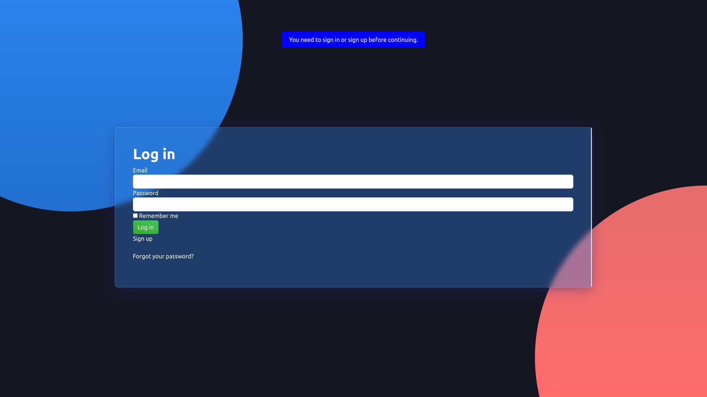
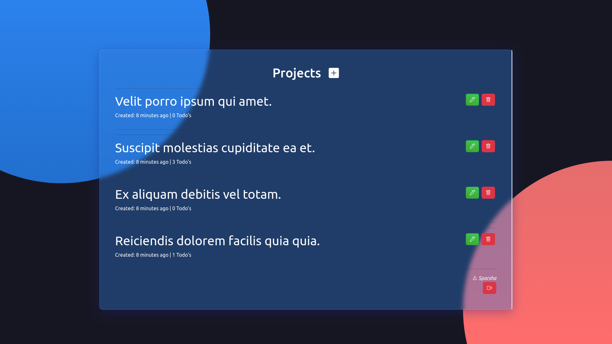
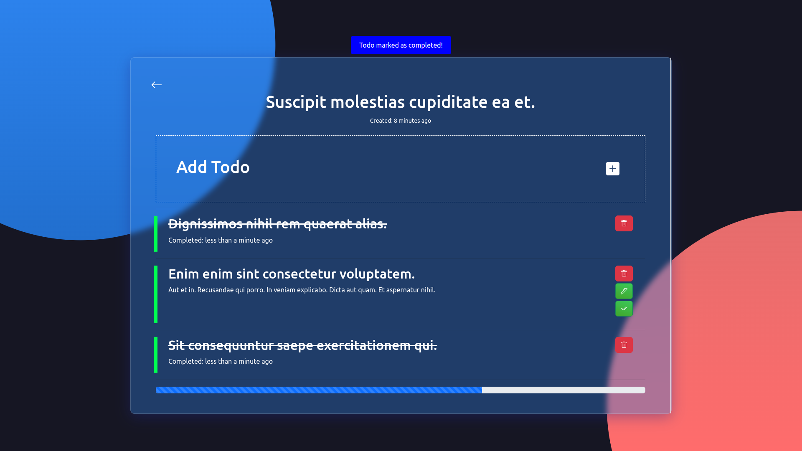

# Todolist







## Requirements
- ruby "3.2.2"
- rails 7.0.8
- postgres
- node >= 14.x

## Installation
```
git clone git@github.com:sparshalc/Todolist.git
cd Todolist
bundle install
```
## Database setup
```
## Development Env.
rails db:create
rails db:migrate
rails db:seed (For Dummy Data's)

```

## Assets installation
```
bundle i
npm i
```

## Run the project
```
rails server || bin/dev(requires foreman)
```
And then visit the http://localhost:3000


* You need to install the chromedriver first to stimulate the feature specs.